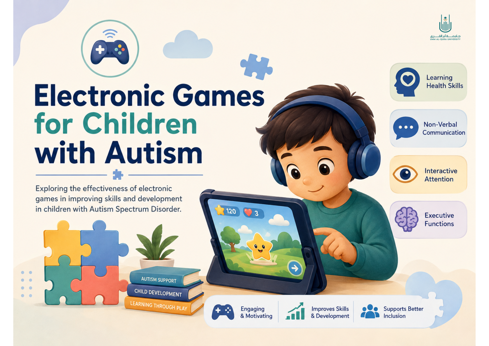
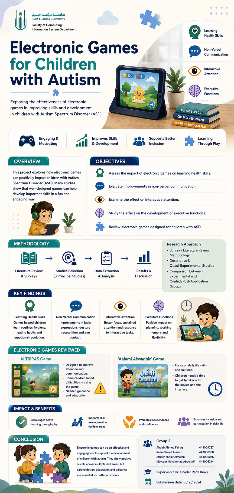

  

# The Effectiveness of Electronic Games for Children with Autism

A literature review exploring the impact of electronic games on developing different skills among children with Autism Spectrum Disorder (ASD).

---

## 📌 Project Overview

This project examines the effectiveness of electronic games and gamification in supporting children with Autism Spectrum Disorder (ASD).

The report focuses on the impact of electronic games on four main areas:

- Learning health skills
- Non-verbal communication
- Interactive attention
- Executive functions

The study also reviews electronic games developed for children with autism, including **ALTRIRAS** and **Aalami Alssaghir**.

---

## 🎯 Objectives

The report aims to investigate whether electronic games developed for children with autism can contribute to improvements in:

- Concentration and attention
- Communication skills
- Visual and auditory processing
- Health-related skills
- Non-verbal communication
- Interactive attention
- Executive functions

---

## 🔎 Methodology

The project uses a **survey/literature review methodology**.

The research team reviewed relevant studies and extracted information related to:

- Authors
- Study focus
- Target groups
- Results
- Evaluation methods
- Research methodology

The reviewed data was gathered from studies found through:

- Google Scholar
- Saudi Digital Library (SDL)
- A graduation project presented at the INJAZ exhibition of Umm Al-Qura University

The report reviewed **six studies** related to the research topic.

---

## 📚 Reviewed Studies

The report discusses studies covering different aspects of electronic games and autism, including:

- Development of health skills
- Development of non-verbal communication skills
- Improvement of interactive attention
- Development of executive functions
- Educational games designed for children with autism
- ALTRIRAS: a game for training children with autism in recognizing basic emotions
- Aalami Alssaghir

---

## 📊 Results

The reviewed studies showed positive effects of electronic games across several skill areas, including:

- Health skills
- Non-verbal communication
- Interactive attention
- Executive functions

The report also discusses cases where children experienced difficulties using some of the reviewed games.

For example, the reviewed ALTRIRAS study reported difficulties among children with autism when answering questions in the game, while the Aalami Alssaghir study reported that children needed time to become familiar with the device used.

---

## 🎮 ALTRIRAS

The report includes examples of the ALTRIRAS game interface and training activities.

The documented examples include:

- Home interface
- Facial expression activities
- Teaching emotions
- Emotion training
- Winning feedback
- Retry feedback

These examples are included in the project report.

---

## 📝 Conclusion & Recommendations

The report concludes that the learning environment plays an important role in the response of children with autism and discusses electronic educational games as a modern educational approach.

The report recommends:

1. Conducting training workshops for professionals on modern methods.
2. Diversifying the activities provided to children.
3. Involving families in prepared programs.
4. Supporting studies and research related to children with autism.

---

## 🖼️ Project Poster

  

---

## 📄 Project Report

The complete project report is available here:

📥 [View Project Report](electronic-games-autism-report.pdf)

---

## 👥 Team Members

**Group 2**

- Ahdab Ahmed Fairaq
- Reem Saeed Alasmri
- Atheer Mutair Almatani
- Maysam Mohammad Abduljalil

**Supervisor:** Dr. Ghader Reda Kurdi

**Department:** Information System Department  
**Faculty:** Faculty of Computing  
**University:** Umm Al-Qura University

---

## 📅 Project Information

**Submission Date:** 5 February 2024

---

## 📚 References

The project report includes references to the studies and sources used throughout the literature review.

For the complete references and source details, please refer to the:

📄 [Full Project Report](electronic-games-autism-report.pdf)
